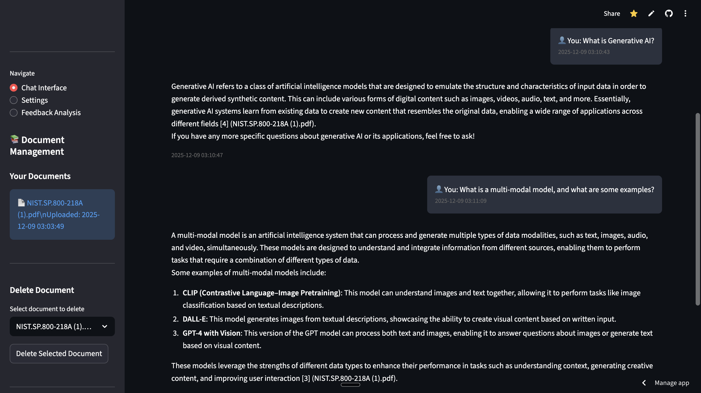
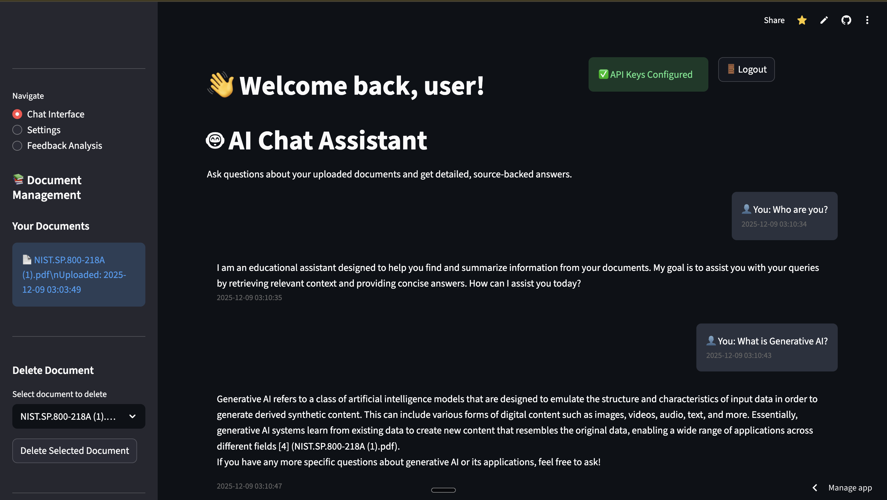

# Educational AI Assistant

[](https://education-assistant-6smbo5cwjphtnc3qphcbkh.streamlit.app/)

An **agentic AI system** for intelligent document Q&A, built with LangChain's tool-calling framework, RAG (Retrieval-Augmented Generation), and multi-user architecture. The agent autonomously decides which tools to invoke—search, list, or summarize—to ground responses in user-uploaded documents.

## 🤖 How it Works

This system employs an **autonomous agent** that:
- **Reasons** about user queries to determine the best approach
- **Selects tools** dynamically (search → summarize, or direct retrieval)
- **Maintains context** across conversation turns with windowed memory
- **Self-corrects** by retrieving additional context when needed

This creates a more intelligent, flexible system that adapts to varying user needs rather than following scripted flows.

## 🏗️ Architecture Overview

```
┌─────────────────────────────────────────────────────────────────┐
│                         User Interface                          │
│                      (Streamlit App)                            │
└────────────────────────────┬────────────────────────────────────┘
                             │
                             ▼
┌─────────────────────────────────────────────────────────────────┐
│                    LangChain Agent Core                         │
│  ┌──────────────────────────────────────────────────────────┐  │
│  │  Agent Executor (gpt-4o-mini)                            │  │
│  │  • Analyzes query intent                                 │  │
│  │  • Selects appropriate tool(s)                           │  │
│  │  • Orchestrates multi-step reasoning                     │  │
│  │  • Memory: ConversationBufferWindowMemory (k=6)          │  │
│  └──────────────────────────────────────────────────────────┘  │
└────────────────────────────┬────────────────────────────────────┘
                             │
                             ▼
┌─────────────────────────────────────────────────────────────────┐
│                        Agent Tools                               │
│  ┌──────────────┐  ┌──────────────┐  ┌────────────────────┐   │
│  │ search_docs  │  │  list_docs   │  │  summarize_text    │   │
│  │              │  │              │  │                    │   │
│  │ • Semantic   │  │ • Enumerate  │  │ • Condense chunks  │   │
│  │   search     │  │   user docs  │  │ • Bullet format    │   │
│  └──────┬───────┘  └──────────────┘  └────────────────────┘   │
│         │                                                        │
│  ┌──────┴──────────────────────────────────────────────┐       │
│  │ summarize_last_answer                               │       │
│  │ • Recall previous response for follow-ups           │       │
│  └─────────────────────────────────────────────────────┘       │
└────────────────────────────┬────────────────────────────────────┘
                             │
                             ▼
┌─────────────────────────────────────────────────────────────────┐
│                    Data & Retrieval Layer                        │
│  ┌────────────────────┐  ┌────────────────────────────────┐    │
│  │  Vector Store      │  │  Relational Database           │    │
│  │  (Pinecone)        │  │  (PostgreSQL / SQLite)         │    │
│  │                    │  │                                │    │
│  │ • User namespaces  │  │ • Auth & API keys (encrypted)  │    │
│  │ • Ada-002 embeds   │  │ • Document metadata            │    │
│  │ • Semantic search  │  │ • Feedback & audit logs        │    │
│  └────────────────────┘  └────────────────────────────────┘    │
└─────────────────────────────────────────────────────────────────┘
```

## ✨ Key Features

### Agentic Intelligence
- **Tool-calling agent** powered by OpenAI function-calling (gpt-4o-mini)
- **Multi-step reasoning**: Agent chains tool invocations to answer complex queries
- **Conversational memory**: 6-turn window for context-aware follow-ups
- **Self-grounding**: Always retrieves context before answering to prevent hallucination

### Retrieval-Augmented Generation (RAG)
- **Semantic search** via OpenAI embeddings (text-embedding-ada-002) + Pinecone
- **Source citation**: Responses include chunk indices and filenames `[1] (document.pdf)`
- **Document-specific queries**: Filter retrieval by filename when needed
- **Intelligent chunking**: 2000-char chunks with 500-char overlap for context preservation

### Multi-User Architecture
- **User-scoped namespaces**: Complete data isolation in Pinecone
- **Encrypted storage**: User API keys encrypted at rest (AES-256)
- **PostgreSQL persistence** for production; SQLite fallback for local dev
- **Optional S3 integration**: Encrypted PDF storage (AES-256 SSE)

### Production-Ready Features
- **Optional TTS**: ElevenLabs voice synthesis for responses
- **Feedback capture**: Star ratings and comments for model improvement
- **Audit logging**: Admin view for user actions (upload/delete/query)
- **Deduplication**: SHA-256 hashing prevents duplicate document uploads

## 🛠️ Tech Stack

| Category | Technologies |
|----------|-------------|
| **Agent Framework** | LangChain (AgentExecutor, Tools, Memory) |
| **LLM** | OpenAI GPT-4o-mini (function-calling), Ada-002 (embeddings) |
| **Vector DB** | Pinecone (serverless, cosine similarity) |
| **Relational DB** | PostgreSQL (production) / SQLite (dev) |
| **Frontend** | Streamlit (multi-page app) |
| **Storage** | S3-compatible (optional, encrypted) |
| **Auth** | Custom user management with encrypted credentials |
| **PDF Processing** | PyPDF2 |
| **TTS** | ElevenLabs API (optional) |

## 🚀 Quick Start

### Prerequisites
- Python 3.12+
- OpenAI API key (required)
- Pinecone API key (required)
- PostgreSQL connection (recommended) or SQLite (local dev)
- ElevenLabs API key (optional, for TTS)

### Setup

```bash
# Clone and navigate to project
git clone https://github.com/edebbyi/education-assistant.git
cd education-assistant

# Create virtual environment
python3 -m venv .venv
source .venv/bin/activate  # On Windows: .venv\Scripts\activate

# Install dependencies
pip install -r requirements.txt

# Configure environment (copy and edit)
cp .env.example .env
# Edit .env with your API keys:
#   OPENAI_API_KEY=sk-...
#   PINECONE_API_KEY=...
#   APP_ENCRYPTION_KEY=<base64-urlsafe-32-byte-key>
#   PGHOST, PGPORT, PGDATABASE, PGUSER, PGPASSWORD (for Postgres)
#   ELEVENLABS_API_KEY (optional)

# Run the app
streamlit run app.py
```

Visit `http://localhost:8501` to access the interface.

### Environment Variables

| Variable | Required | Description |
|----------|----------|-------------|
| `OPENAI_API_KEY` | ✅ | OpenAI API key for embeddings & chat |
| `PINECONE_API_KEY` | ✅ | Pinecone API key for vector storage |
| `APP_ENCRYPTION_KEY` | ✅ | 32-byte key for encrypting stored credentials |
| `PG*` variables | ⚠️ | PostgreSQL connection (recommended for production) |
| `ELEVENLABS_API_KEY` | ❌ | Optional voice synthesis |
| `S3_*` variables | ❌ | Optional encrypted PDF storage |
| `ADMIN_USERS` | ❌ | Comma-separated list for audit log access |

> **Security Note**: Never commit `.env` or `.data/` to version control. Rotate keys immediately if exposed.

## 🧪 Testing

```bash
# Run all tests
pytest -q

# Test database connectivity (uses PG* env if set)
pytest tests/test_database_connection.py -v

# Test agent behavior
pytest tests/test_agent.py -v
```

## 📚 Documentation

- **[Architecture Deep Dive](docs/ARCHITECTURE.md)**: Detailed agent design, tool specifications, and data flow
- **[Usage Guide](docs/USAGE.md)**: Example queries, features, and best practices
- **[API Reference](docs/README.md)**: Original technical documentation

## 🌐 Live Demo

Try the deployed application: [**Educational AI Assistant on Streamlit Cloud**](https://education-assistant-6smbo5cwjphtnc3qphcbkh.streamlit.app/)

### Application Screenshots

<div align="center">
  
  <p><em>Interactive chat interface with document-grounded responses</em></p>
  
  
  <p><em>Multi-user document management and knowledge base</em></p>
</div>

## 📁 Project Structure

```
education-assistant/
├── app.py                          # Streamlit entry point & routing
├── src/
│   ├── core/
│   │   ├── agent.py                # LangChain agent orchestration
│   │   ├── tools.py                # Tool definitions (search, list, summarize)
│   │   ├── document_processor.py  # PDF ingestion, embeddings, Pinecone I/O
│   │   ├── response_generator.py  # Response formatting
│   │   └── voice_synthesizer.py   # ElevenLabs TTS integration
│   ├── database/
│   │   ├── database.py             # Postgres/SQLite adapter
│   │   ├── database_manager.py    # Database operations
│   │   └── feedback_manager.py    # User feedback persistence
│   ├── auth/
│   │   ├── auth_manager.py         # User authentication
│   │   └── user_settings.py        # API key management (encrypted)
│   ├── ui/
│   │   ├── auth_interface.py       # Login/signup UI
│   │   ├── database_viewer.py      # Document management UI
│   │   └── admin_audit.py          # Admin audit log viewer
│   └── utils/
│       ├── crypto.py               # Encryption utilities
│       ├── storage.py              # S3 integration
│       └── audit.py                # Action logging
├── tests/                          # Pytest suite
├── docs/                           # Extended documentation
└── requirements.txt                # Python dependencies
```

## 🔒 Security & Privacy

- **User isolation**: Each user operates in a separate Pinecone namespace
- **Encryption at rest**: API keys encrypted with Fernet (AES-256)
- **No hardcoded secrets**: All credentials via environment variables
- **Audit trail**: Admin logs track document operations
- **S3 SSE**: Optional server-side encryption for stored PDFs

## 🤝 Contributing

This is a portfolio project demonstrating agentic AI architecture. For questions or collaboration:
- **GitHub**: [edebbyi/education-assistant](https://github.com/edebbyi/education-assistant)
- **Issues**: Use GitHub Issues for bug reports or feature requests

## 📄 License

[MIT License](LICENSE) - See LICENSE file for details.

---

**Made with** LangChain • OpenAI • Pinecone • Streamlit
